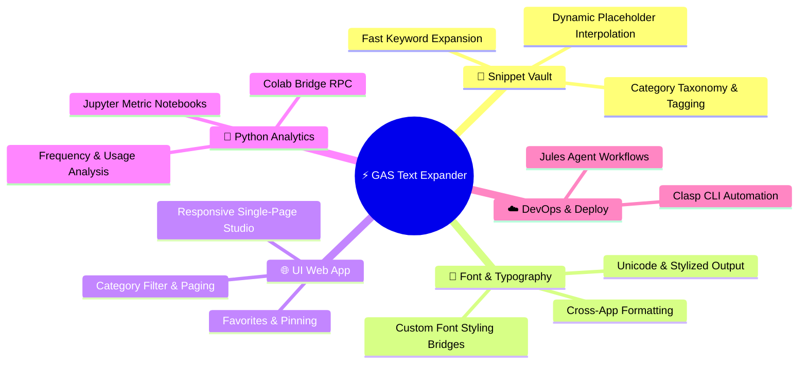
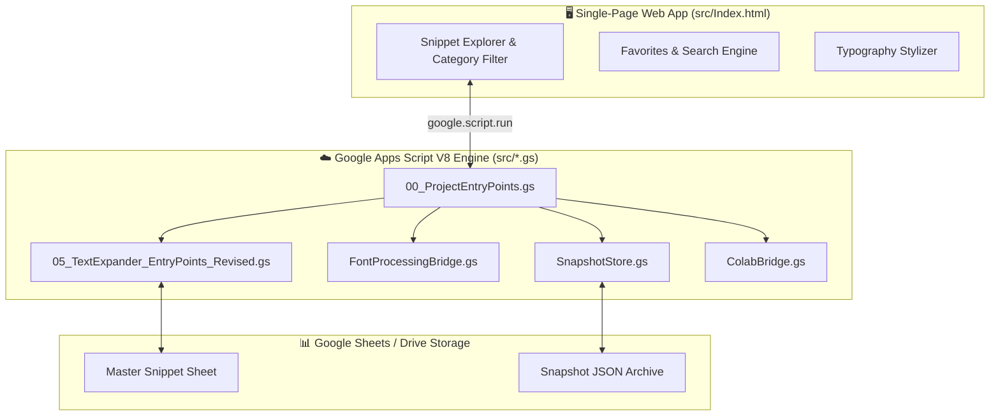

<!-- ⚡ G.A.S. TEXT EXPANDER MANAGER — REPOSITORY PRESENTATION (L3 SHOWCASE) -->

<div align="center">


# **⚡ G.A.S. Text Expander Manager**

**An enterprise snippet vault, automated text expansion engine, font typography bridge, and Python analytics studio powered by Google Apps Script V8.**

[](package.json)
[](src/appsscript.json)
[](.clasp.json)
[](notebooks/)
[](LICENSE)
[](https://github.com/traikdude/G.A.S_Text_Expander_Manager)

<p align="center">
  <a href="#-overview"><b>Overview</b></a> •
  <a href="#-core-modules"><b>Modules</b></a> •
  <a href="#-snippet-architecture"><b>Architecture</b></a> •
  <a href="#-python-analytics-bridge"><b>Python Bridge</b></a> •
  <a href="#-quick-start--clasp"><b>Quick Start</b></a> •
  <a href="#-contributing"><b>Contributing</b></a> •
  <a href="#-license"><b>License</b></a>
</p>

</div>

---

## 📑 Table of Contents

- [✨ Overview](#-overview)
- [🚀 Core Modules](#-core-modules)
  - [1. Enterprise Snippet & Text Expansion Vault](#1-enterprise-snippet--text-expansion-vault)
  - [2. Interactive Single-Page Web App (`Index.html`)](#2-interactive-single-page-web-app-indexhtml)
  - [3. Typography & Font Processing Bridge](#3-typography--font-processing-bridge)
  - [4. Snapshot State Store & Favorites Manager](#4-snapshot-state-store--favorites-manager)
  - [5. Python Analytics & Colab Integration](#5-python-analytics--colab-integration)
- [🏗️ Snippet Architecture & Build Flow](#-snippet-architecture--build-flow)
- [🐍 Python Analytics Bridge](#-python-analytics-bridge)
- [⚡ Quick Start & Clasp Deployment](#-quick-start--clasp-deployment)
- [🗂️ Repository Structure](#-repository-structure)
- [🤝 Contributing](#-contributing)
- [📄 License](#-license)

---

## ✨ Overview

**G.A.S. Text Expander Manager** is a full-featured text expansion, snippet management, and typography transformation platform engineered for Google Apps Script and Google Workspace.

Equipped with a standalone single-page responsive web console (`Index.html`), modular backend services in `src/`, automated category filters, font bridges, snapshot stores, and Python analytics notebooks, the system empowers teams to organize, search, transform, and trigger text expansions across their entire workspace.

---

## 🚀 Core Modules



### 1. Enterprise Snippet & Text Expansion Vault
Create and manage multi-paragraph boilerplate, email templates, code blocks, and dynamic placeholders with real-time category filtering and pagination.

### 2. Interactive Single-Page Web App (`Index.html`)
120KB+ self-contained responsive client featuring live search, instant preview, category chips, and one-click copy to clipboard.

### 3. Typography & Font Processing Bridge
Converts plain text into stylized typography and rich unicode fonts for headings, social updates, and presentations via [`FontProcessingBridge.gs`](src/FontProcessingBridge.gs).

### 4. Snapshot State Store & Favorites Manager
Saves versioned state snapshots to Google Drive and tracks frequently used expansion macros via [`SnapshotStore.gs`](src/SnapshotStore.gs) and [`favorites.gs`](src/favorites.gs).

### 5. Python Analytics & Colab Integration
Bridge between Apps Script and Python/Colab notebooks (`notebooks/`, `generate_notebooks.py`) to analyze expansion frequency and macro efficiency.

---

## 🏗️ Snippet Architecture & Build Flow



---

## 🐍 Python Analytics Bridge

The repository includes a Python automation suite to evaluate text expansion usage:

```bash
# Install Python dependencies
pip install -r requirements.txt

# Generate analytical Jupyter notebooks
python generate_notebooks.py
```

---

## ⚡ Quick Start & Clasp Deployment

### Prerequisites
* [Node.js](https://nodejs.org/) (v18+)
* [@google/clasp](https://www.npmjs.com/package/@google/clasp)

### Setup Instructions
1. Clone the repository:
   ```bash
   git clone https://github.com/traikdude/G.A.S_Text_Expander_Manager.git
   cd G.A.S_Text_Expander_Manager
   ```
2. Install dependencies:
   ```bash
   npm install
   ```
3. Authenticate with Google Apps Script:
   ```bash
   npx clasp login
   ```
4. Push project files to Google Apps Script:
   ```bash
   npm run clasp:push
   ```

---

## 🗂️ Repository Structure

```text
G.A.S_Text_Expander_Manager/
├── docs/                        # Presentation & visual assets
│   └── assets/
│       └── banner.png           # L3 Showcase high-resolution hero banner
├── src/                         # Modular Google Apps Script V8 source
│   ├── Index.html               # 120KB+ Single-page web console
│   ├── 00_ProjectEntryPoints.gs # WebApp doGet/doPost routing
│   ├── FontProcessingBridge.gs  # Typography formatting engine
│   ├── SnapshotStore.gs         # Versioned snapshot persistence
│   ├── ColabBridge.gs           # Colab RPC connection bridge
│   ├── favorites.gs             # Quick access & pinning logic
│   └── uiHandlers.gs            # UI modal and action controllers
├── notebooks/                   # Jupyter analysis & usage notebooks
├── tools/                       # Auxiliary developer scripts
├── package.json                 # Project dependencies & Clasp scripts
├── requirements.txt             # Python analytics requirements
├── generate_notebooks.py        # Automated notebook generator
├── README.md                    # L3 Showcase presentation documentation
└── LICENSE                      # MIT Open Source License
```

---

## 🤝 Contributing

1. Fork the repository and create your branch (`git checkout -b feature/new-expansion-module`).
2. Add new modular `.gs` services in `src/` or update UI templates in `src/Index.html`.
3. Test locally and deploy with `npm run clasp:push`.
4. Submit a Pull Request.

---

## 📄 License

Distributed under the **MIT License**. See [LICENSE](LICENSE) for details.

---

<div align="center">

*Engineered for Productivity Masters, Workspace Automators & AI Agents.*  
**GAS Text Expander Manager · Google Apps Script · Python · Clasp**

</div>
